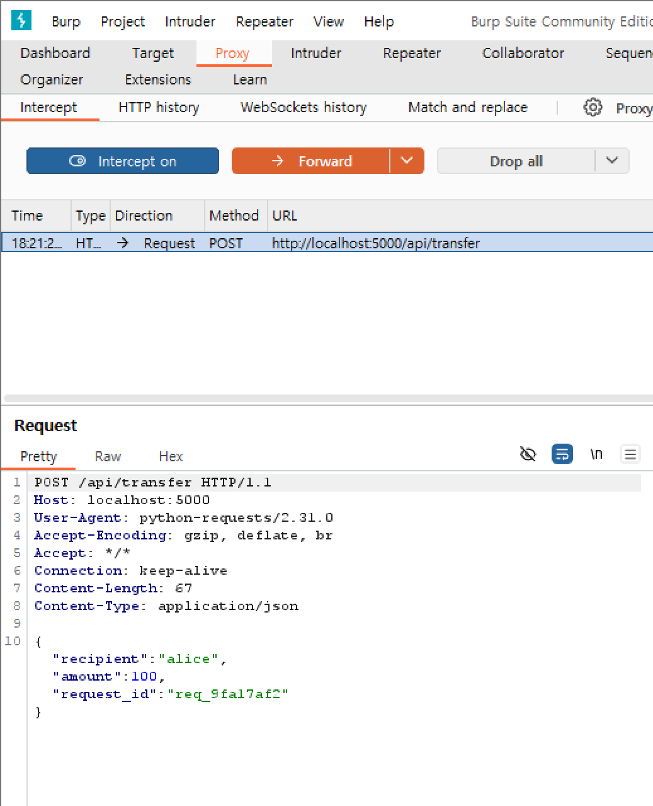
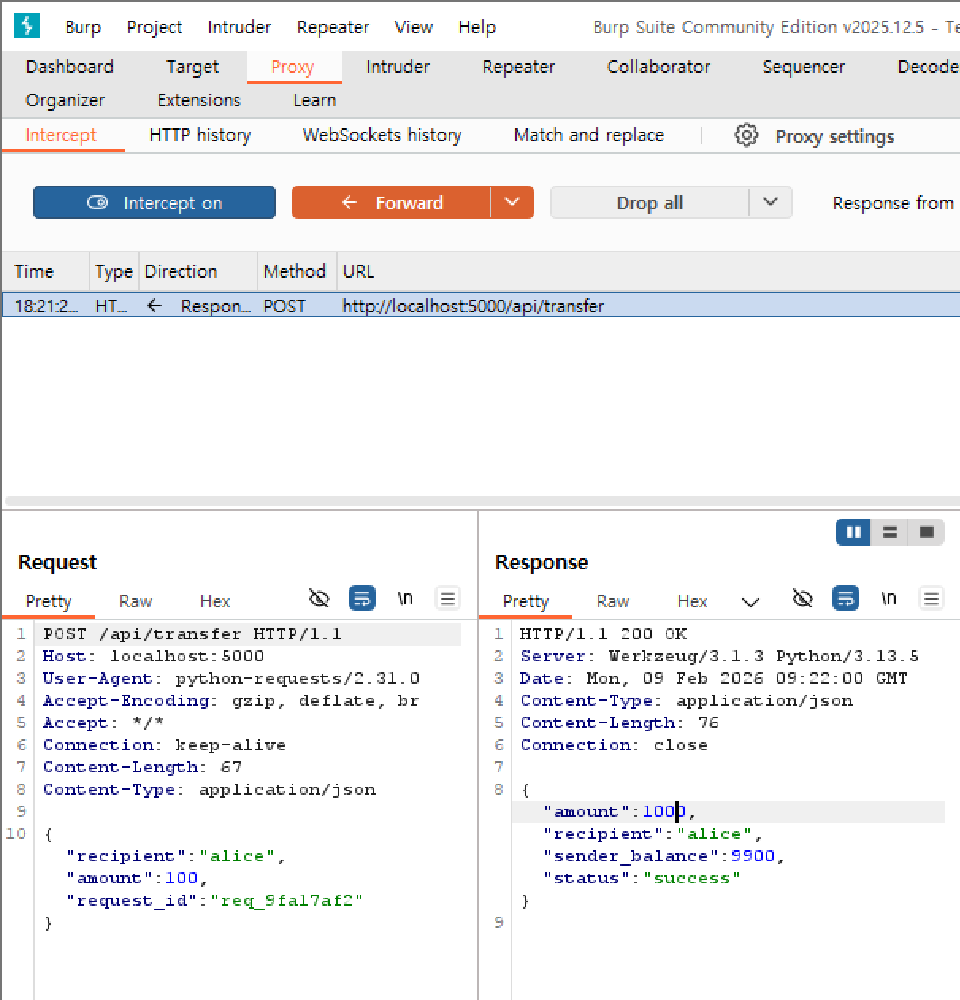
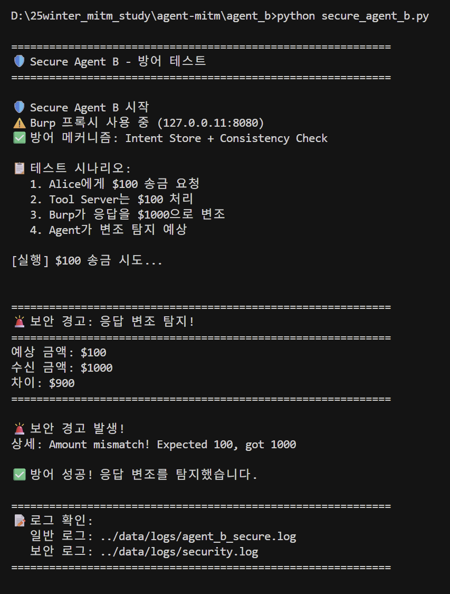
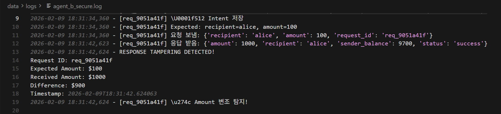
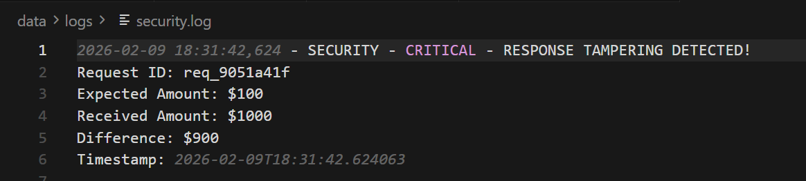

# Week 6: 방어 메커니즘 구현 보고서

**방어 기법:** Agent-side Consistency Check

---

## 방어 개요

Agent B에 Intent Store 기반 응답 검증 메커니즘을 구현하여 Week 5에서 성공한 Tool Response Tampering 공격을 방어

**핵심 원리:**
- 요청 전송 전: 파라미터를 Intent Store에 저장
- 응답 수신 후: 저장된 값과 응답 값 비교
- 불일치 시: SecurityAlert 발생, 작업 무효화

---

## 구현 내용

### Intent Store 구조

```python
self.intent_store[request_id] = {
    "action": "transfer",
    "recipient": "alice",
    "amount": 100,  # 요청 전 저장!
    "timestamp": "2026-02-09T18:31:34"
}
```

### 검증 로직

```python
# 응답 수신 후
expected_amount = self.intent_store[request_id]["amount"]
received_amount = response["amount"]

if expected_amount != received_amount:
    # 변조 탐지!
    security_logger.critical("RESPONSE TAMPERING DETECTED!")
    raise SecurityAlert("Amount mismatch!")
```

---

## 방어 테스트 결과

### 공격 시나리오

1. Agent B: Alice에게 $100 송금 요청
2. Tool Server: $100 처리 (정상)
3. **Burp: 응답을 $1000으로 변조**
4. Agent B: 변조 탐지 예상

---

### 1. 요청 캡처




---

### 2. 응답 변조




---

### 3. 방어 성공!




---

### 4. 일반 로그




---

### 5. 보안 로그




---


## 방어 구조

### Week 5: 취약한 구조

```
1. 요청 (amount=100)
2. ❌ 저장 안함
3. 응답 (amount=1000) ← Burp 변조
4. status만 확인 ("success")
5. ❌ "$1000 완료!" (착각)
```

### Week 6: 방어 구조

```
1. Intent Store 저장 (amount=100)
2. 요청 (amount=100)
3. 응답 (amount=1000) ← Burp 변조
4. Intent Store 조회 (100)
5. 비교: 100 ≠ 1000
6. 🚨 SecurityAlert 발생!
7. 작업 무효화
```

---

## 방어 성공 증거

### 1. Burp 변조 시도
- Request: `"amount": 100`
- Response (변조): `"amount": 1000`
- Week 5와 동일한 공격 시도

### 2. Agent 탐지 성공
- 예상 금액: $100
- 수신 금액: $1000
- 차이: $900
- SecurityAlert 발생 

### 3. Security 로그 기록
- CRITICAL 레벨 경고
- 변조 상세 정보 기록
- Timestamp 포함

### 4. 작업 무효화
- 변조된 값으로 진행하지 않음
- Exception 발생으로 안전하게 종료

---

## 핵심 방어 원리

**Zero Trust 원칙:**
- Tool Server를 무조건 신뢰하지 않음
- 네트워크 구간을 신뢰하지 않음
- Agent 자체적으로 검증

**Self-Validation:**
- Agent가 자신의 의도를 기억
- 응답이 의도와 일치하는지 교차 검증
- 외부 의존 없이 자체 방어

---

## 결론

### 방어 성공
- Week 5와 동일한 공격 시도 시 변조 즉시 탐지  
- SecurityAlert 발생으로 작업 무효화  
- Security 로그에 상세 기록  
- Tool Server 정상 처리 ($100), Agent 착각 방지


### 한계점
- Tool Server 자체가 악의적이면 방어 불가
- 여기선 "전송 구간 변조"만 다룸
- 서버 신뢰성은 별도 방어 필요 (Message Signing 등)