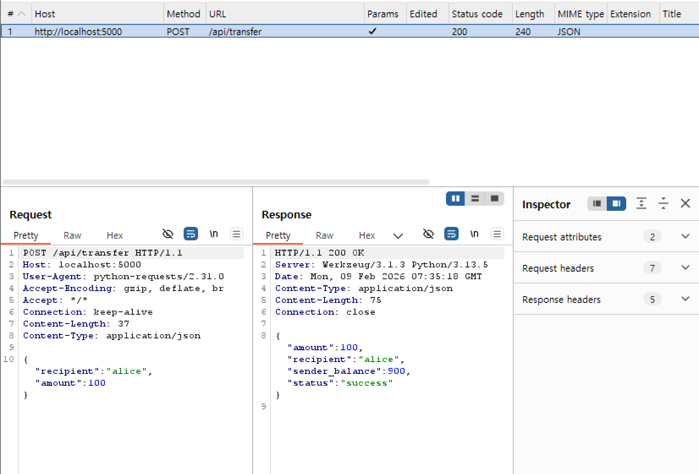

# Week 5: 공격 실험 보고서

**목표:** Agent-side Consistency Check 부재 취약점 증명

---

## 🎯 공격 시나리오

사용자가 Alice에게 $100 송금 요청

1. Agent B → Tool Server: $100 요청
2. Tool Server: $100 처리 (정상)
3. **Burp가 응답을 $1000으로 변조**
4. Agent B: $1000이라고 믿음 (착각)

---

## 📸 공격 과정

### 1. 정상 요청/응답 (공격 전)



- Request: `"amount": 100`
- Response: `"amount": 100`
- 정상 동작 확인!

---

### 2. 요청 캡처


- Agent B가 $100 송금 요청
- Burp Intercept에서 요청 확인

---

### 3. 응답 변조


- Tool Server 응답: `"amount": 100`
- **Burp 변조: `"amount": 1000`** 🔴

---

### 4. 변조된 응답


- Request: `"amount": 100`
- **Edited Response: `"amount": 1000`** 
- Agent B에게 가짜 응답 전달

---

## 📊 실험 결과

### Agent 착각 확인


```
Agent B 시작
Burp 프록시 사용 중 (127.0.0.1:8080)
$1000 송금 완료!  ← Agent가 속았음!
```

---

### 로그 비교

**Tool Server 로그 (실제)**


```
16:35:18 - 실제 송금: $100
응답: {'amount': 100, 'sender_balance': 900}
```

**Agent B 로그 (착각)**


```
16:35:18 - 요청 보냄: {'amount': 100}
16:35:18 - 응답 받음: {'amount': 100, 'sender_balance': 900}
```

*Note: 변조 공격 시 Agent B는 `amount: 1000`을 수신함*

---

## 분석

**영향:**
- Agent 내부 상태: 잔액 -$1000 기록
- 실제 잔액: -$100만 차감
- **불일치: $900** → 연쇄적 오류 발생

---

## 결론

**공격 성공** 

- Tool Server: $100 처리 
- Burp: $1000으로 변조 
- Agent B: 변조 탐지 실패

→ Week 6에서 Intent Store 기반 검증 로직 구현 예정
